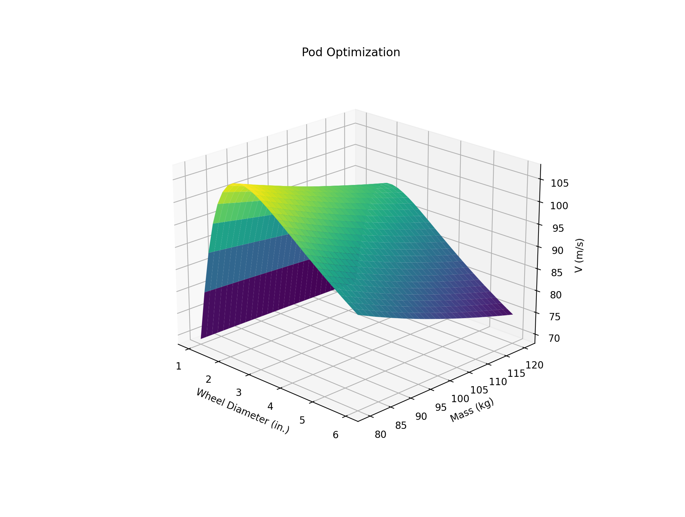

# HyperLoop Pod Run Simulation
During my 3rd year at the University of California, Irvine I helped the HyperXite competition team with a performance simulation. The purpose of the simulation is to model all propulsive elements of the pod to determine optimization points and expected performance. Some questions we attempted to answer were:

- What is the best number of batteries?
- What is the best propulsion wheel diameter?
- What is the best combination of specifications per dollar?

## Example Run

With the simulation, we could fix certain parameters and leave others open to be determined over combinations. Typically, we did this over two variables to get a 3d surface to pick an optimized combination from. We were able to answer all of these questions with this simulation, but sadly were not able to finish building the pod.

## Example Optimization Surface

# Framework

The model is fairly simple, we look at the set of motors that we have and generate functions for the output torque given the current RPM. This way we can determine the pod acceleration over the run and integrate using an extended Euler integration. This iterates over and over given a timestep. 

Throughout each iteration the braking distance is estimated and the brakes are triggered when we would stop a given distance away from the end of the tube called the allowable. The gif above shows all relevant distances from the model.

# Questions

Let me know if you have any questions or suggestions!